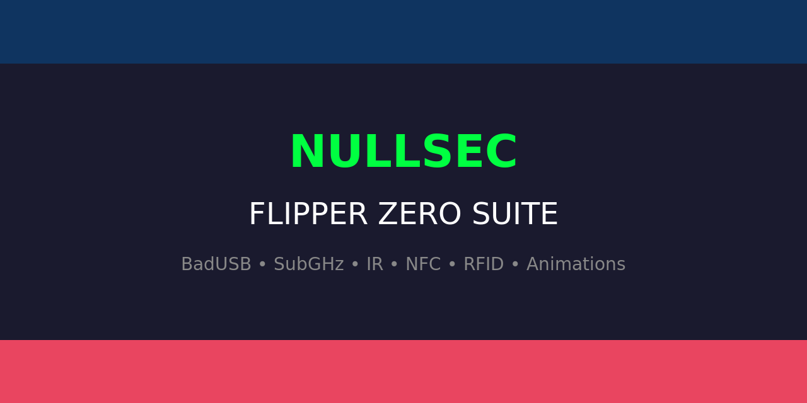

<p align="center">
  
</p>

<h1 align="center">🐬 NullSec Flipper Zero Suite</h1>

<p align="center">
  <b>The Ultimate Flipper Zero Payload & Resource Collection</b><br>
  <i>430+ files — BadUSB, SubGHz, IR, NFC, RFID, Animations & more</i>
</p>

<p align="center">
  <a href="https://github.com/bad-antics/nullsec-flipper-suite/stargazers"></a>
  <a href="https://github.com/bad-antics/nullsec-flipper-suite/network/members"></a>
  
  
  
  <a href="LICENSE"></a>
</p>

<p align="center">
  <a href="#-quick-install">Quick Install</a> •
  <a href="#-badusb-payloads">BadUSB</a> •
  <a href="#-subghz">SubGHz</a> •
  <a href="#-infrared">Infrared</a> •
  <a href="#-other-resources">Resources</a>
</p>

---

## 📦 Suite Overview

| Category | Count | Description |
|----------|------:|-------------|
| 💻 **BadUSB** | **80** | Windows, Linux & macOS exploitation payloads |
| 📻 **SubGHz** | **40** | RF signal captures and templates (315-915 MHz) |
| 📡 **Infrared** | **16** | Universal remote controls for TVs, ACs, streaming |
| 💳 **NFC** | **3** | Mifare Classic & NTAG card templates |
| 🏷️ **RFID** | **3** | EM4100, HID ProxII, Indala templates |
| 🔑 **iButton** | **2** | Dallas/Cyfral key templates |
| 🎵 **Music** | **5** | Custom tunes for the Flipper speaker |
| 🐬 **Animations** | **81** | Custom dolphin animations & asset packs |
| 📱 **Apps** | **36** | Custom application resources |
| 🎨 **Assets** | **158** | Icons, graphics & visual resources |
| | **430+** | **Total files** |

---

## ⚡ Quick Install

### Method 1: qFlipper (Recommended)
```bash
git clone https://github.com/bad-antics/nullsec-flipper-suite
```
Connect your Flipper via USB → Open qFlipper → Drag & drop folders to SD card.

### Method 2: Direct Copy
```bash
git clone https://github.com/bad-antics/nullsec-flipper-suite
cd nullsec-flipper-suite

# Copy everything to Flipper SD card
cp -r badusb/nullsec /ext/badusb/
cp -r subghz/nullsec /ext/subghz/
cp -r infrared/nullsec /ext/infrared/
cp -r nfc/nullsec /ext/nfc/
cp -r rfid/nullsec /ext/rfid/
```

### Method 3: Web Installer
Download the [latest release](https://github.com/bad-antics/nullsec-flipper-suite/releases) ZIP and extract to your Flipper SD card.

### Firmware Compatibility
| Firmware | Supported |
|----------|:---------:|
| Official | ✅ |
| Momentum | ✅ |
| Xtreme | ✅ |
| Unleashed | ✅ |
| RogueMaster | ✅ |

---

## 💻 BadUSB Payloads (80)

The largest BadUSB collection in any single Flipper Zero suite. All payloads use DuckyScript 2.0 syntax.

### Recon & Discovery (1-10)
| # | Payload | Target | Description |
|---|---------|--------|-------------|
| 01 | SystemRecon | Windows | Full system enumeration |
| 02 | WiFiStealer | Windows | Saved WiFi passwords extraction |
| 03 | ReverseShell | Windows | PowerShell reverse shell |
| 04 | DisableDefender | Windows | Disable Windows Defender |
| 05 | CredDump | Windows | Credential dumping |
| 06 | BrowserData | Windows | Browser history, cookies, passwords |
| 07 | Keylogger | Windows | PowerShell keylogger install |
| 08 | NetworkScan | Windows | Network discovery & mapping |
| 09 | SAMDump | Windows | SAM database extraction |
| 10 | Persistence | Windows | Registry-based persistence |

### Social Engineering (11-20)
| # | Payload | Target | Description |
|---|---------|--------|-------------|
| 11 | FakeUpdate | Windows | Fake Windows Update screen |
| 12 | WebcamSnap | Windows | Silent webcam capture |
| 13 | ClipboardStealer | Windows | Clipboard history extraction |
| 14 | ScreenCapture | Windows | Screenshot exfiltration |
| 15 | USBExfil | Windows | USB-based data exfil |
| 16 | RickRoll | Windows | Classic RickRoll prank |
| 17 | WallpaperPrank | Windows | Desktop wallpaper hijack |
| 18 | VoicePrank | Windows | Text-to-speech prank |
| 19 | DisableMouse | Windows | Disable mouse input |
| 20 | InvertScreen | Windows | Invert display colors |

### Cross-Platform (21-30)
| # | Payload | Target | Description |
|---|---------|--------|-------------|
| 21 | LinuxRecon | Linux | Full Linux enumeration |
| 22 | LinuxReverseShell | Linux | Bash reverse shell |
| 23 | MacOSRecon | macOS | macOS system info extraction |
| 24 | DownloadExecute | Windows | Download & execute payload |
| 25 | CreateAdmin | Windows | Create hidden admin account |
| 26 | CloudTokenStealer | Windows | AWS/Azure/GCP token theft |
| 27 | SSHKeyHarvest | Windows | SSH key extraction |
| 28 | VPNCredGrab | Windows | VPN credential extraction |
| 29 | GitRepoStealer | Windows | Git credentials & repos |
| 30 | SlackDiscordTokens | Windows | Chat app token extraction |

### Advanced Exploitation (31-40)
| # | Payload | Target | Description |
|---|---------|--------|-------------|
| 31 | BrowserBackdoor | Windows | Browser extension backdoor |
| 32 | PasswordMgrDump | Windows | Password manager database extraction |
| 33 | EDRKiller | Windows | EDR/AV evasion & disable |
| 34 | ADRecon | Windows | Active Directory recon |
| 35 | CryptoWalletStealer | Windows | Cryptocurrency wallet extraction |
| 36 | AzureO365Stealer | Windows | Azure/O365 token theft |
| 37 | DBCredHunter | Windows | Database credential hunting |
| 38 | MacOSKeychain | macOS | Keychain extraction |
| 39 | ContainerSecrets | Linux | Docker/K8s secret extraction |
| 40 | RATDropper | Windows | Remote access trojan dropper |

### Cloud & DevOps (41-50)
| # | Payload | Target | Description |
|---|---------|--------|-------------|
| 41 | AWSCredHarvest | Windows | AWS credential files |
| 42 | DockerSecretsGrab | Linux | Docker secrets extraction |
| 43 | KubernetesTokenGrab | Linux | K8s service account tokens |
| 44 | AzureTokenExtract | Windows | Azure managed identity tokens |
| 45 | GCPCredStealer | Windows | GCP service account keys |
| 46 | TerraformStateGrab | Windows | Terraform state file secrets |
| 47 | BrowserSessionHijack | Windows | Browser session cookie theft |
| 48 | VSCodeExtensions | Windows | VS Code extension backdoor |
| 49 | ChromePasswordDump | Windows | Chrome saved password extraction |
| 50 | EnvVarSecrets | Windows | Environment variable secrets |

### Hardware & Firmware (51-60)
| # | Payload | Target | Description |
|---|---------|--------|-------------|
| 51 | WiFiDeauthTrigger | Windows | WiFi deauth via system commands |
| 52 | BIOSExtractor | Windows | BIOS/UEFI firmware extraction |
| 53 | MemoryForensics | Windows | RAM dump for analysis |
| 54 | HypervisorDetect | Windows | VM/hypervisor detection |
| 55 | FirmwareExtractor | Windows | Device firmware extraction |
| 56 | ADShadowCreds | Windows | AD shadow credentials attack |
| 57 | LinuxSSHHarvest | Linux | SSH key & config extraction |
| 58 | MacOSKeychainDump | macOS | macOS Keychain full dump |
| 59 | CICDCredHarvest | Linux | CI/CD pipeline credential theft |
| 60 | BrowserSessionClone | Windows | Browser session cloning |

### Defense Evasion & Persistence (61-70)
| # | Payload | Target | Description |
|---|---------|--------|-------------|
| 61 | WindowsFirewallDisable | Windows | Disable all firewall profiles |
| 62 | DNSPoisonLocal | Windows | Local hosts file DNS poisoning |
| 63 | WiFiHotspotRogue | Windows | Create rogue WiFi hotspot |
| 64 | PowerShellEmpire | Windows | Empire C2 stager deployment |
| 65 | CronPersistence | Linux | Crontab backdoor persistence |
| 66 | RegistryBackdoor | Windows | Registry run key persistence |
| 67 | FileExfiltrator | Windows | Sensitive file search & exfil |
| 68 | RDPEnabler | Windows | Enable RDP remote access |
| 69 | NetcatListener | Windows | Persistent netcat bind shell |
| 70 | LogCleaner | Windows | Windows event log cleaner |

### Advanced Persistence & Collection (71-80)
| # | Payload | Target | Description |
|---|---------|--------|-------------|
| 71 | ScheduledTaskPersist | Windows | Scheduled task persistence |
| 72 | DisableUAC | Windows | Disable User Account Control |
| 73 | WiFiProbeCapture | Windows | Capture all saved WiFi profiles |
| 74 | SystemdBackdoor | Linux | systemd service persistence |
| 75 | MacOSLaunchDaemon | macOS | macOS LaunchDaemon persistence |
| 76 | BitLockerKeyDump | Windows | BitLocker recovery key extraction |
| 77 | ThunderbirdMailDump | Windows | Thunderbird email extraction |
| 78 | WMIEventPersist | Windows | Fileless WMI event persistence |
| 79 | NTLMRelayCrack | Windows | NTLM hash capture & crack |
| 80 | SystemInfoExfil | Windows | Full system inventory + cloud exfil |

---

## 📻 SubGHz Signals (40)

RF signal captures and templates across common frequencies.

| Signal | Frequency | Description |
|--------|-----------|-------------|
| alarm_jammer_433 | 433 MHz | Alarm system jammer |
| alarm_remote | 433 MHz | Alarm system remote |
| car_alarm_test_315 | 315 MHz | Car alarm trigger test |
| car_remote_fcc | 315 MHz | Car remote (FCC) |
| ceiling_fan_315 | 315 MHz | Ceiling fan remote |
| doorbell_433mhz | 433 MHz | Doorbell signal |
| doorbell_spam | 433 MHz | Doorbell spam |
| drone_rth_trigger | 433 MHz | Drone RTH trigger |
| eu_barrier_868 | 868 MHz | EU barrier gate |
| ev_charger_unlock | 433 MHz | EV charger unlock |
| fan_remote | 433 MHz | Fan remote |
| fireplace_315 | 315 MHz | Electric fireplace |
| garage_315mhz | 315 MHz | Garage door (US) |
| garage_390mhz | 390 MHz | Garage door (US) |
| garage_bruteforce | 315 MHz | Garage brute force |
| gas_station_sign | 433 MHz | Gas station sign |
| gate_868mhz | 868 MHz | Gate remote (EU) |
| gate_opener_390 | 390 MHz | Gate opener |
| hotel_lock_rf | 433 MHz | Hotel lock RF |
| industrial_sensor_spoof | 433 MHz | Industrial sensor |
| intercom_433 | 433 MHz | Wireless intercom |
| keyfob_jammer_433 | 433 MHz | Keyfob jammer |
| led_strip_433 | 433 MHz | LED strip controller |
| lora_jam_915 | 915 MHz | LoRa jammer |
| medical_alert_test | 433 MHz | Medical alert test |
| outlet_remote | 433 MHz | Power outlet remote |
| panic_button_315 | 315 MHz | Panic button test |
| parking_barrier | 433 MHz | Parking barrier |
| pool_pump_315 | 315 MHz | Pool pump remote |
| projector_screen | 433 MHz | Projector screen |
| restaurant_pager | 433 MHz | Restaurant pager |
| roller_shade_433 | 433 MHz | Roller shade motor |
| scooter_unlock_433 | 433 MHz | Scooter unlock |
| smart_lock_315 | 315 MHz | Smart lock |
| smarthome_915 | 915 MHz | Smart home hub |
| solar_inverter_reset | 433 MHz | Solar inverter |
| sprinkler_433 | 433 MHz | Sprinkler system |
| tesla_charge_port | 315 MHz | Tesla charge port |
| tire_pressure_315 | 315 MHz | TPMS sensor |
| weather_station | 433 MHz | Weather station |

---

## 📡 Infrared Remotes (16)

Universal remote controls for TVs, ACs, and streaming devices.

| Remote | Protocol | Description |
|--------|----------|-------------|
| AC_Daikin | NECext | Daikin air conditioner |
| AC_Samsung | Samsung32 | Samsung air conditioner |
| AC_Universal | NEC | Universal AC remote |
| Apple_TV | NECext | Apple TV remote |
| Fire_TV | NECext | Amazon Fire TV |
| Hisense_TV | NEC | Hisense TV |
| LG_TV | NEC | LG TV |
| Projector | NEC | Universal projector |
| Roku | NECext | Roku streaming |
| Samsung_TV | Samsung32 | Samsung TV |
| Sony_TV | SIRC | Sony TV |
| Soundbar | NEC | Universal soundbar |
| TCL_TV | NEC | TCL TV |
| TV_OFF_Universal | Mixed | **Turn off ANY TV** (18 codes) |
| TV_Universal | NEC | Universal TV remote |
| Vizio_TV | NEC | Vizio TV |

---

## 📦 Other Resources

### 💳 NFC (3 templates)
- Mifare Classic 1K blank
- Mifare Classic 4K blank  
- NTAG215 blank (amiibo compatible)

### 🏷️ RFID (3 templates)
- EM4100 blank
- HID ProxII blank
- Indala blank

### 🔑 iButton (2 templates)
- Dallas DS1990A
- Cyfral

### 🎵 Music Player (5 tunes)
Custom melodies for the Flipper's piezo speaker.

### 🐬 Animations & Assets (239 files)
Custom dolphin animations, asset packs, and visual themes.

---

## 📁 Project Structure

```
nullsec-flipper-suite/
├── badusb/nullsec/      # 80 DuckyScript payloads
├── subghz/nullsec/      # 40 RF signal files
├── infrared/nullsec/    # 16 IR remote controls
├── nfc/nullsec/         # 3 NFC card templates
├── rfid/nullsec/        # 3 RFID card templates
├── ibutton/nullsec/     # 2 iButton templates
├── music_player/        # 5 custom tunes
├── asset_pack/          # 81 asset pack files
├── assets/              # 158 visual resources
├── apps/                # 36 app resources
├── README.md
└── LICENSE
```

---

## 🔗 Related Projects

| Project | Description |
|---------|-------------|
| [nullsec-pineapple-suite](https://github.com/bad-antics/nullsec-pineapple-suite) | 96+ WiFi Pineapple Pager payloads |
| [nullsec-linux](https://github.com/bad-antics/nullsec-linux) | Security-focused Linux distro |
| [nullsec-exploit](https://github.com/bad-antics/nullsec-exploit) | Exploit development framework |
| [marshall](https://github.com/bad-antics/marshall) | NullSec Privacy Browser |

---

## ⚠️ Legal Disclaimer

**For authorized penetration testing and educational purposes ONLY.**

- ❌ Do NOT use on systems without explicit written permission
- ❌ Unauthorized computer access is a federal crime
- ✅ Get written authorization before testing
- ✅ Use in controlled lab environments only
- ✅ You are solely responsible for your actions

---

## 📄 License

MIT License — See [LICENSE](LICENSE) for details.

---

<p align="center">
  <b>NullSec</b> — <i>430+ tools in your pocket</i> 🐬<br>
  <a href="https://github.com/bad-antics">github.com/bad-antics</a>
</p>
